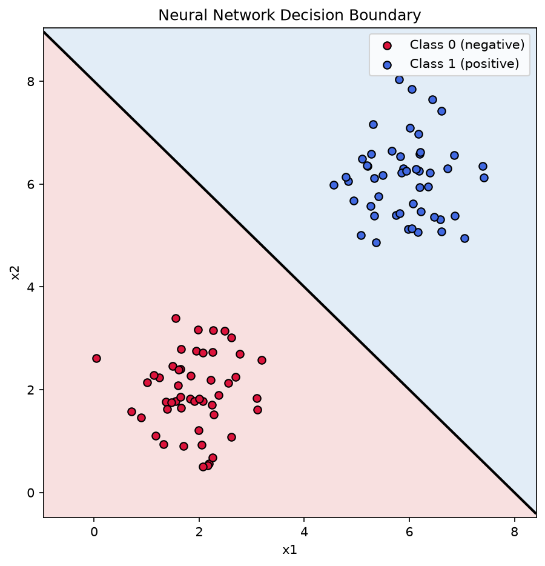

# Neural Network Inference: TensorFlow vs. NumPy

A from-scratch implementation of neural network forward propagation, built alongside Andrew Ng's Machine Learning Specialization (Course 2: Advanced Learning Algorithms, Week 1).

## Overview

This project implements forward propagation (inference) for a small binary classification neural network in three different ways — TensorFlow, vectorized NumPy, and a neuron-by-neuron NumPy for-loop — and verifies that all three produce identical predictions.

**Scope note:** This project covers *inference only*, matching what's taught in Week 1 of Course 2. Weights and biases are hand-set, not learned — training (backpropagation) is Week 2 material and outside this project's scope.

## What's covered

- Neural network architecture: 2 input features → hidden layer (3 neurons) → output layer (1 neuron)
- Sigmoid activations
- Forward propagation implemented via:
  - TensorFlow's `Sequential` / `Dense` API
  - Vectorized NumPy (matrix multiplication)
  - Manual NumPy for-loop (neuron-by-neuron), matching the course's "general implementation" lecture
- Cross-validation between all three implementations (max floating-point difference ~1e-07)
- Decision boundary visualization on a synthetic 2D dataset

## Results

All three implementations achieve 100% accuracy on the synthetic dataset and agree with each other within floating-point precision.



## Project structure
week4-neural-network-inference/
├── week4_neural_network_inference.ipynb
├── decision_boundary.png
├── requirements.txt
└── README.md
## How to run

```bash
python3 -m venv venv
source venv/bin/activate
pip install -r requirements.txt
jupyter notebook week4_neural_network_inference.ipynb
```

## Tools

Python, NumPy, TensorFlow, Matplotlib, Jupyter

## Part of

[ml-portfolio](../) — a series of ML projects built in lockstep with Andrew Ng's Machine Learning Specialization.
